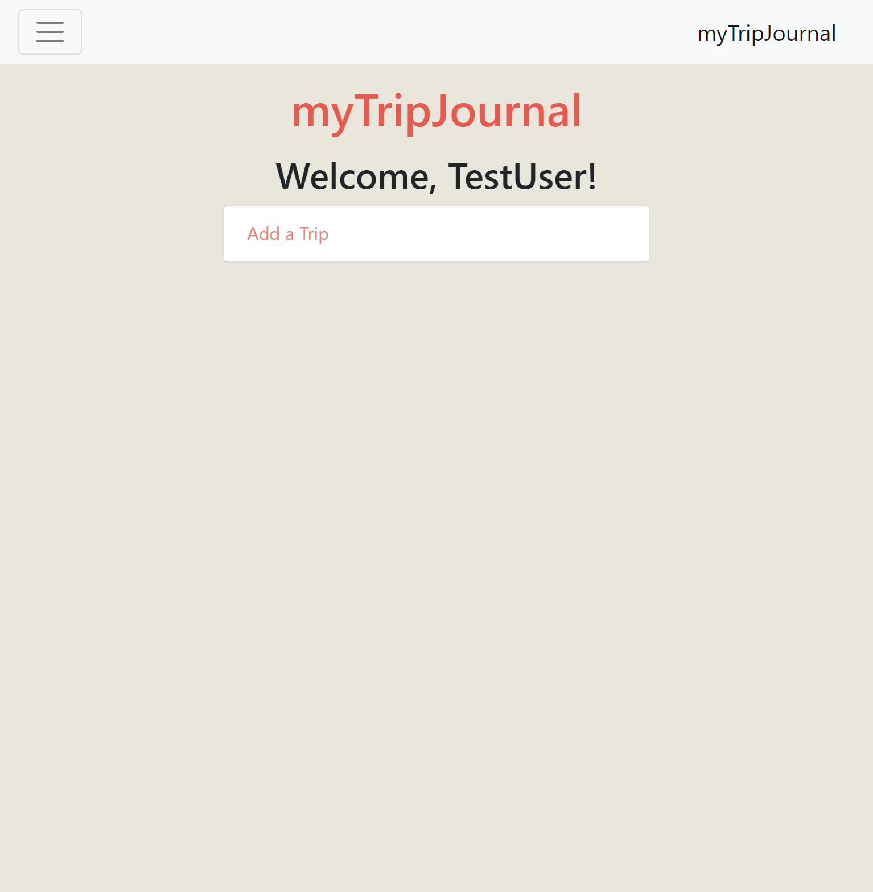
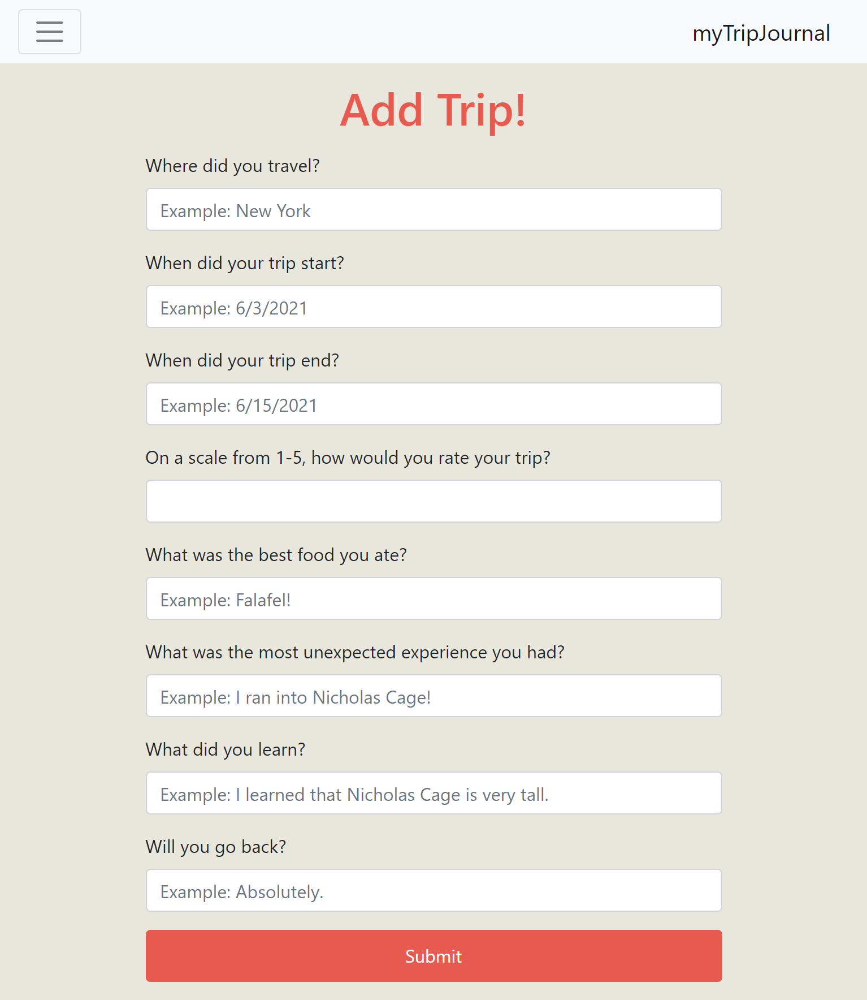
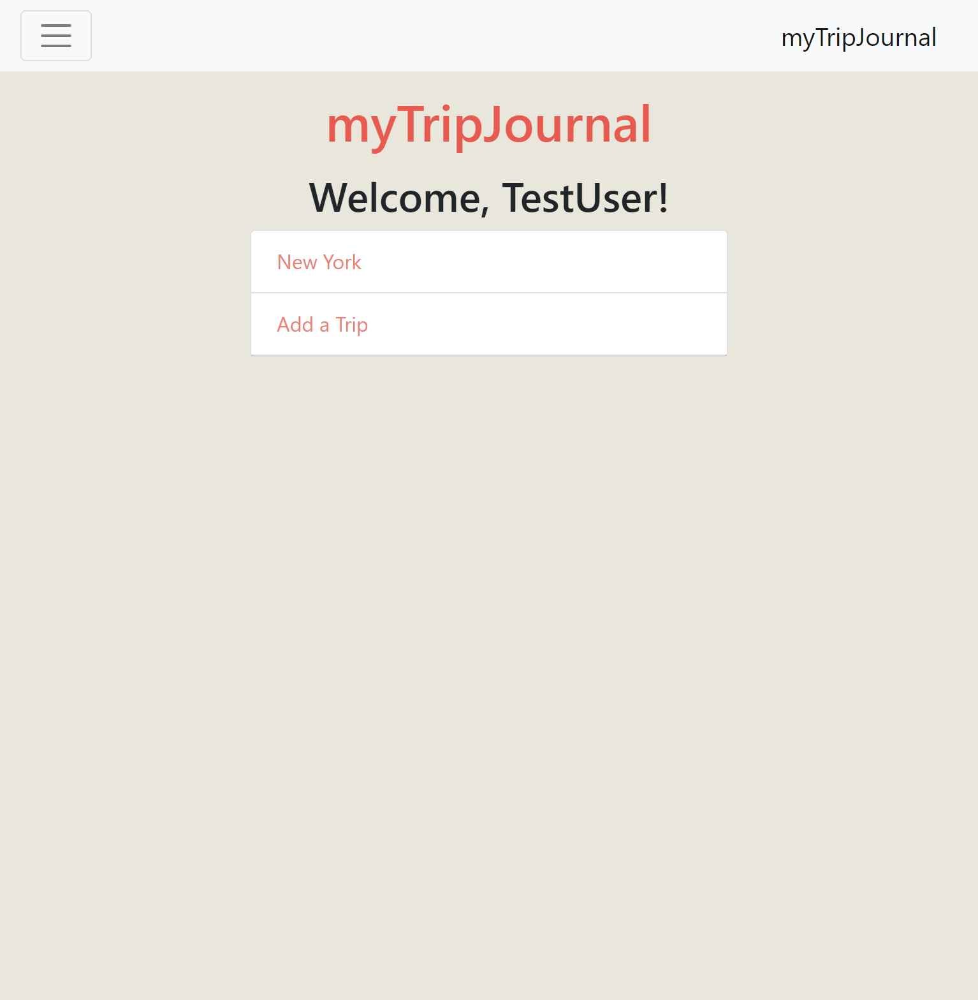
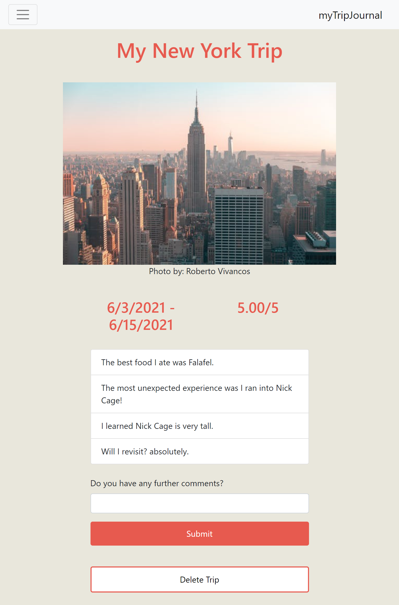
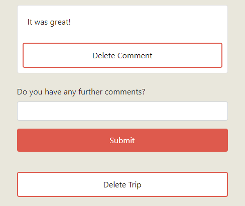

# My Trip Journal 

## Description

This travler application is an easy way for a user to write down and track thier travel experience's with minimal effort. First sign up with My Trip Journal. This allows a user to add and delete a trip experience. Simply answer the questions and it will generate your trip experience answers with a picture of the location you visited.

## Table of Contents

[Description](#description)

[Features](#features)

[Links](#links)

[Collaborators](#collaborators)

## Features

Front End Javascript,
Back End Express, 
Node.js,
Secret Key, .env file,
Pexels API

When the user navigates to the homepage, they will see a brief description of what the app offers so they know what they are signing up for. 

Upon signing up/logging in, the user is presented with a list of the previously created trips as well as an option to create a new trip. 

Each trip page contains the answers the user provides on the add trip page as well as an image of the city they are logging. 

The trip page also has an option to add/delete a comment.

## Links

[GitHub Repository](https://github.com/jmoniz155/my-trip-journal)

[Deployed Heroku Application](https://my-trip-journal2.herokuapp.com/)

## Setup
If you are working from your command line, follow these steps to start the app. 
1. Run `npm i`.
2. Create a .env file with relevant secrets
3. Run `mysql -u root -p` 
4. Run `npm run seed` to seed the database.
6. Run `npm start` to start the app.

If you are looking to use the deployed app, navigate to the heroku deployed app linked above. 

## Collaborators

My Trip Journal was developed by [Erica Snyder](https://github.com/ericaleesnyder), [Jesse Moniz](https://github.com/jmoniz155), [Mitchell Riley](https://github.com/Pherenzia), and [Kalani Mojica](https://github.com/mojikalani). 

